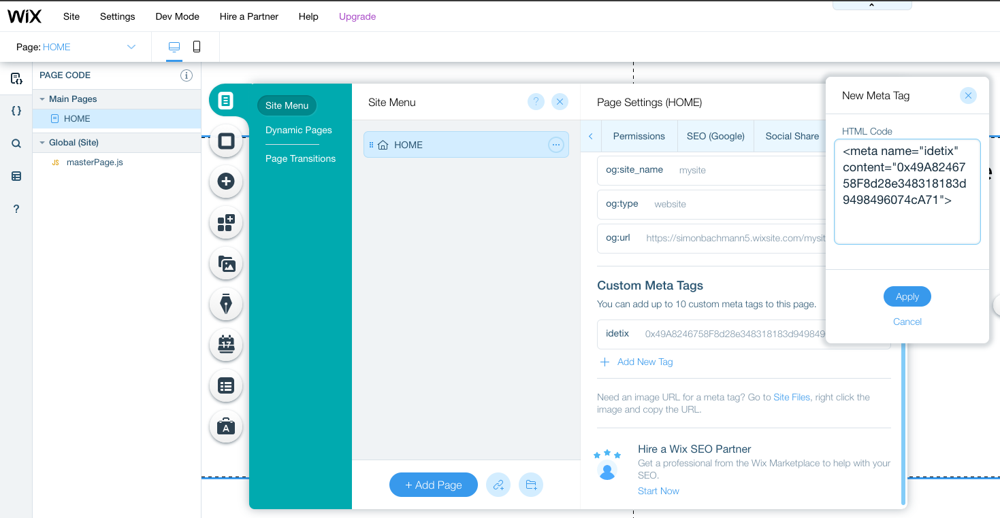

# verifier-api

This module is responsible for verifying social trust certificates. 

The trust between two parties can be increased by proofing the ownership of social profiles and websites. By including the same ETH public key that also created the event on the Ethereum blockchain we can make sure the same entity also has access to the offial event website.


:information_source: This module will be consumed by the guest-client. However, the module is not required to make the trust system work. Any user can do the verification himself by visiting the website/social profile himself and compare the ETH address with the smart contract. Therefore, this module does not act a trusted entity in the system.

## Run with Docker
1. Build the image:
```bash
docker build -t idetix/verifierapi . 
```
2. Create a Twitter API token on https://developer.twitter.com/en/portal/dashboard

3. Copy the Twitter API token and past the bearer authentication token including the prefix `Bearer`
```bash
docker run -p 8080:8080  -e "TWITTER_BEARER_TOKEN=<YOUR TWITTER API BEARER TOKEN>" -t idetix/verifierapi
```

## Endpoints

The endpoints can be explored and tested out directly with Swagger on http://localhost:8080/swagger-ui.html

## Trust Certificates

### Website
To enable a website as a social trust certificate, one only has to add one extra html-tag to the website as follows:
```html
<html>
  <head>
    <meta name="idetix" content="0x49A8246758F8d28e348318183d9498496074cA71">
  </head>
  <body>
    ...
  </body>
</html>
```
:warning: The ETH address must be the same as the one that created the event on the blockchain.

### Twitter
To enable a Twitter profile as a social trust certificate, one has to add the ETH address to the bio of the profile. The address can coexist among other information in the biography and will be picked up.

<p align="center">
  
</p>

:warning: The ETH address must be the same as the one that created the event on the blockchain.

### Other
More social trust certificates can be added in a similar matter to increase the trust between two parties without the need of a trusted third party.

## Demonstration
For demo purposes a WIX website was created (https://simonbachmann5.wixsite.com/mysite). No coding knowledge is required to add the social trust certificate as WIX allows adding meta tags in just a few clicks as shown in the image below.

<p align="center">
  
</p>

